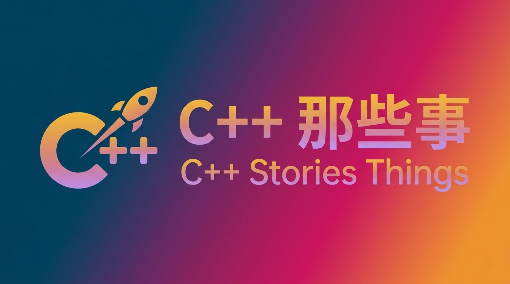

<div align="center">

<p align="center">
  
</p>

# Stories About C Plus Plus

<p align="center">
  <a href="./README.md">🇨🇳 中文</a> |
  <a href="./README_EN.md">🇺🇸 English</a>
</p>

<p align="center">
  <a href="https://github.com/Light-City/CPlusPlusThings/stargazers">
    
  </a>
  <a href="https://github.com/Light-City/CPlusPlusThings/network/members">
    
  </a>
  <a href="https://github.com/Light-City/CPlusPlusThings/issues">
    
  </a>
  <a href="LICENSE">
    
  </a>
</p>

<p align="center">
  <strong>Stories About C++ | Your Journey from Beginner to Advanced | Deep Dive into Modern C++</strong>
</p>

</div>

---

- [Stories About C++](#stories-about-c++)
    - [Featured Projects](#featured-projects)
    - [About the Author](#about-the-author)
    - [Project Setup](#project-setup)
      - [Method 1: VSCode + Bazel](#method-1-vscode--bazel)
      - [Method 2: Docker](#method-2-docker)
      - [Method 3: g++](#method-3-g)
    - [Video Tutorials](#video-tutorials)
    - [Feishu Knowledge Base](#feishu-knowledge-base)
    - [Foundation](#foundation)
    - [Practical Exercises](#practical-exercises)
      - [10-Day Practice](#10-day-practice)
      - [Key Exercises](#key-exercises)
    - [C++2.0 New Features](#c20-new-features)
      - [Overview](#overview)
      - [C++11 New Features](#c11-new-features)
      - [C++14/17/20](#c141720)
    - [Design Patterns](#design-patterns)
    - [STL Source Code Analysis](#stl-source-code-analysis)
    - [Concurrency Programming](#concurrency-programming)
      - [C++ Concurrency in Action](#c-concurrency-in-action)
      - [Multithreading and Multiprocess](#multithreading-and-multiprocess)
        - [Threading In C++](#threading-in-c)
    - [C++ Idioms](#c-idioms)
        - [What's your favorite C++ programming idiom?](#whats-your-favorite-c-programming-idiom)
    - [Learning Courses](#learning-courses)
      - [GeekTime "Modern C++ in Action 30 Lessons"](#geektime-modern-c-in-action-30-lessons)
    - [Tools](#tools)
      - [Container Quick Output Tool](#container-quick-output-tool)
      - [Output Like Python (Jupyter Notebook)](#output-like-python-jupyter-notebook)
      - [Observe Compilation Process](#observe-compilation-process)
      - [C++ Debug Tool dbg-macro](#c-debug-tool-dbg-macro)
      - [Linux Debug Tool rr - Ability to Go Back in Time](#linux-debug-tool-rr---ability-to-go-back-in-time)
    - [Extensions](#extensions)
      - [Some Questions](#some-questions)

# Stories About C++

Thank you for your support of *Stories About C++*. The content is also available on Bilibili in video format for easier learning. Welcome to star, share, and submit PRs.

Online Personal Blog: [Light City Lab](https://light-city.github.io/)

Online Learning Site: [Stories About C++](https://light-city.github.io/stories_things/)

- Chinese Name: **C++ 那些事**
- English Name: **Stories About C Plus Plus**

This repository is designed for beginners to advance from <u>**entry level to mastery**</u>. It addresses the needs of <u>**interviewees and learners**</u> who want to <u>**deeply understand C++**</u> and <u>**get started with C++**</u>. Beyond the fundamentals, this repository also covers more advanced topics such as in-depth source code analysis and multi-threaded concurrency. It is a comprehensive C++ learning resource, from beginner to advanced improvement.

> 🎯 **Target Audience**: C++ beginners, interview candidates, developers wanting to systematically learn Modern C++
> 📚 **Content Covered**: C++11/14/17/20 new features, STL source code analysis, design patterns, concurrency programming
> 🔧 **Practice-Oriented**: Complete code examples and practical projects included


### Featured Projects

A series of featured projects have been launched to guide you through practical C++ learning. Combined with this open-source project, you'll grow rapidly!

Direct Link: [Click Here](./proj/README.md)

### About the Author

The WeChat Official Account has opened two major entry points: albums and menus. You can directly read *Stories About C++* content on WeChat, paired with the code in this repository for an excellent experience. We recommend following us.

Personal WeChat Official Account: guangcity

Or scan the QR code below. We welcome your feedback and C++ discussions. I have created a C++ Stories exchange group on WeChat, a high-quality C++ resource exchange area. Please follow the above official account, click the bottom right corner → Contact Me, and I'll add you to the group.

---

> Follow Me

If you find this helpful, follow me~

<table>
  <tbody>
    <tr>
      <th align="center" height="200" width="200">
          <br>
          Planet
      </th>
      <th align="center" height="200" width="200">
          <br>
          WeChat Official Account
      </th>
    </tr>
  </tbody>
</table>


### Project Setup


#### Method 1: VSCode + Bazel

#### Method 2: Docker

A Docker environment without development setup is now available. You can pull the following image:

```
docker pull xingfranics/cplusplusthings:latest
```
#### Method 3: g++


### Video Tutorials

[Episode 1: Step By Step Compiling This Project](https://www.bilibili.com/video/BV1Rv4y1H7LB/?vd_source=bb6532dcd5b1d6b26125da900adb618e)

[Episode 2: Docker Environment Without Setup](https://www.bilibili.com/video/BV1oz4y1a7Pu/?vd_source=bb6532dcd5b1d6b26125da900adb618e)

[Episode 3: Reading HashTable Together, Thoroughly Understanding C++ STL](https://www.bilibili.com/video/BV1o8411U7vy/?vd_source=bb6532dcd5b1d6b26125da900adb618e)

[Episode 4: Reading STL enable_shared_from_this Together](https://www.bilibili.com/video/BV1du4y1w7Mg/?spm_id_from=333.788&vd_source=bb6532dcd5b1d6b26125da900adb618e)

[Episode 5: Reading STL Threads Together, From C++11 thread to C++20 jthread](https://www.bilibili.com/video/BV1DH4y1g7gS/?vd_source=bb6532dcd5b1d6b26125da900adb618e)

[Episode 6: Reading STL condition_variable, condition_variable_any Together](https://www.bilibili.com/video/BV13b421b7Am/?spm_id_from=333.999.0.0&vd_source=bb6532dcd5b1d6b26125da900adb618e)

[Episode 7: Reading STL Mutex Together](https://www.bilibili.com/video/BV1xm42157pq/?spm_id_from=333.999.0.0&vd_source=bb6532dcd5b1d6b26125da900adb618e)

[Episode 8: Reading STL RAII Lock Together](https://www.bilibili.com/video/BV1Ls421g7iq/?spm_id_from=333.788&vd_source=bb6532dcd5b1d6b26125da900adb618e)

### Feishu Knowledge Base

[Internet Big Company Interview Records](https://hmpy6adnp5.feishu.cn/docx/OitBdRB4KozIhTxQt7Ec7iFDnkc)

[Essential Interview Guide for Landing Offers](https://hmpy6adnp5.feishu.cn/docx/B1aCdVTUgoyJGYxtWV7cdvgRnxv)


### Foundation

- [Stories About `const`](./basic_content/const)
- [Stories About `static`](./basic_content/static)
- [Stories About `this`](./basic_content/this)
- [Stories About `inline`](./basic_content/inline)
- [Stories About `sizeof`](./basic_content/sizeof)
- [Stories About Function Pointers](./basic_content/func_pointer)
- [Stories About Pure Virtual Functions and Abstract Classes](./basic_content/abstract)
- [Stories About `vptr_vtable`](./basic_content/vptr_vtable)
- [Stories About `virtual`](./basic_content/virtual)
- [Stories About `volatile`](./basic_content/volatile)
- [Stories About `assert`](./basic_content/assert)
- [Stories About Bit Fields](./basic_content/bit)
- [Stories About `extern`](./basic_content/extern)
- [Stories About `struct`](./basic_content/struct)
- [Stories About `struct` and `class`](./basic_content/struct_class)
- [Stories About `union`](./basic_content/union)
- [Stories About Implementing C++ Polymorphism in C](./basic_content/c_poly)
- [Stories About `explicit`](./basic_content/explicit)
- [Stories About `friend`](./basic_content/friend)
- [Stories About `using`](./basic_content/using)
- [Stories About `::`](./basic_content/maohao)
- [Stories About `enum`](./basic_content/enum)
- [Stories About `decltype`](./basic_content/decltype)
- [Stories About References and Pointers](./basic_content/pointer_refer)
- [Stories About Macros](./basic_content/macro)

### Practical Exercises

#### [10-Day Practice](./practical_exercises/10_day_practice)

- [day1 - Basic Syntax](practical_exercises/10_day_practice/day1)

- [day2 - Recursion, Struct, Enum, Static Variables, etc.](practical_exercises/10_day_practice/day2)

- [day3 - Functions 1](practical_exercises/10_day_practice/day3)

- [day4 - Functions 2](practical_exercises/10_day_practice/day4)

- [day5 - Inheritance and Polymorphism](practical_exercises/10_day_practice/day5)

- [day6 - Virtual Functions and Abstract Classes](practical_exercises/10_day_practice/day6)

- [day7 - Operator Overloading](practical_exercises/10_day_practice/day7)

- [day8 - Templates and STL](practical_exercises/10_day_practice/day8)

- [day9 - Exceptions](practical_exercises/10_day_practice/day9)

- [day10 - Files and Streams](practical_exercises/10_day_practice/day10)

#### [Key Exercises](./practical_exercises/key_exercises/)

- [Bracket Overloading.cpp](./practical_exercises/key_exercises/bracket_overloading.cpp)

- [Clock++ Operator Overloading.cpp](./practical_exercises/key_exercises/clock.cpp)

- [Operator Overloading - Type Casting.cpp](./practical_exercises/key_exercises/operator_cast.cpp)

- [Clock with Parentheses Overloading.cpp](./practical_exercises/key_exercises/operator_circle.cpp)

- [Function Template.cpp](./practical_exercises/key_exercises/func_temp.cpp)

- [Dynamic Array.cpp](./practical_exercises/key_exercises/array.cpp)

- [Dictionary Insertion and Lookup.cpp](./practical_exercises/key_exercises/map_insert_look.cpp)

- [Exception Catching.cpp](./practical_exercises/key_exercises/try.cpp)

- [Class Template - Stack.cpp](./practical_exercises/key_exercises/stack.cpp)

- [Class Template Specialization - Array.cpp](./practical_exercises/key_exercises/array_template.cpp)

- [Inheritance and Encapsulation.cpp](./practical_exercises/key_exercises/override.cpp)

- [File Read and Write Comprehensive Exercise.cpp](./practical_exercises/key_exercises/read_file.cpp)

- [Input/Output Operator Overloading.cpp](./practical_exercises/key_exercises/io_operator_overload.cpp)

- [Input/Output Overloading.cpp](./practical_exercises/key_exercises/io_operator.cpp)

- [Output Format.cpp](./practical_exercises/key_exercises/output.cpp)


### [C++2.0 New Features](./cpp2.0)

#### Overview

C++2.0 is a shorthand for "Modern C++", including C++11/14/17/20.

#### [C++11 New Features](./cpp2.0/cpp11)

- [Variadic Templates](./cpp2.0/cpp11/variadic)

- Spaces in Template Expressions

  ```cpp
  vector<list<int> > // ok in each C++ version
  vector<list<int>> // before C++11 error: '>>' should be '> >' within a nested template argument list, compiles normally from C++11 onwards
  ```

- [nullptr and nullptr_t](./cpp2.0/cpp11/nullptr.cpp)

- [Automatic Type Deduction with auto](./cpp2.0/cpp11/auto.cpp)

- [Uniform Initialization](./cpp2.0/cpp11/uniform_initialization.cpp)

- [initializer_list](./cpp2.0/cpp11/initializer.cpp)

- [explicit for ctors taking more than one argument](./cpp2.0/cpp11/explicit.cpp)

- [range-based for statement](./cpp2.0/cpp11/auto.cpp)

  ```cpp
  for(decl:col) {
      statement
  }
  ```

- [=default, =delete](./cpp2.0/cpp11/default_delete.cpp)

  If you define a `ctor` yourself, the compiler won't provide a `default ctor`.
  If you force add `=default`, you can regain and use the `default ctor`.

- Alias (化名) Template (template typedef)

  - [alias.cpp](./cpp2.0/cpp11/alias.cpp)
  - [template_template.cpp](./cpp2.0/cpp11/template_template.cpp)

- [template template parameter](./cpp2.0/cpp11/template_template.cpp)

- [type alias](./cpp2.0/cpp11/type_alias.cpp)

- [noexcept](./cpp2.0/cpp11/noexcept.cpp)

- [override](./cpp2.0/cpp11/override.cpp)

- [final](./cpp2.0/cpp11/final.cpp)

- [decltype](./cpp2.0/cpp11/decltype.cpp)

- [lambda](./cpp2.0/cpp11/lambda.cpp)

- [Rvalue reference](./cpp2.0/cpp11/rvalue.cpp)

- [move aware class](./cpp2.0/cpp11/move.cpp)

- Container Structure and Classification

  - (1) Sequential containers include: `array` (new in C++2.0), `vector`, `deque`, `list`, `forward_list` (new in C++2.0)
  - (2) Associative containers include: `set/multiset`, `map/multimap`
  - (3) Unordered containers (new in C++2.0, replacing `hash_xxx` with `unordered_xxx`) include: `unordered_map/unordered_multimap`, `unordered_set/unordered_multiset`

- [Hash Function](./cpp2.0/cpp11/hash.cpp)

- [tuple](./cpp2.0/cpp11/tuple.cpp)

  Learning Material: https://www.bilibili.com/video/av51863195?from=search&seid=3610634846288253061

#### C++14/17/20

To be updated...

### Design Patterns

- [Singleton Pattern](./design_pattern/singleton)
- [Producer-Consumer Pattern](./design_pattern/producer_consumer)

### [STL Source Code Analysis](./src_analysis/stl)

**STL Source Code Analysis: gcc 4.9.1**

- [array](./src_analysis/stl/array.md)
- [deque](./src_analysis/stl/deque.md)
- [queue and stack](./src_analysis/stl/queue_stack.md)
- [list](./src_analysis/stl/list.md)
- [vector](./src_analysis/stl/vector.md)
- [typename](./src_analysis/stl/typename.md)
- [traits](./src_analysis/stl/traits.md)
- [iterator](./src_analysis/stl/iterator.md)
- [Discussion on STL Design - EBO Optimization](./src_analysis/stl/谈谈STL设计之EBO优化.md)
- [rb_tree](./src_analysis/stl/rb_tree.md)
- [set and multiset](./src_analysis/stl/set_multiset.md)
- [map and multimap](./src_analysis/stl/map_multimap.md)
- [hashtable](./src_analysis/stl/hashtable.md)
- [myhashtable](./src_analysis/stl/myhashtable.md)
- [unordered_map](./src_analysis/stl/unordered_map.md)

### [Concurrency Programming](./concurrency)

#### C++ Concurrency in Action

- [Chapter 1](./concurrency/concurrency_v1/chapter1)
- [Chapter 2](./concurrency/concurrency_v1/chapter2)

Learning Material: https://downdemo.gitbook.io/cpp-concurrency-in-action-2ed/

#### Multithreading and Multiprocess

##### Threading In C++

- [Introduction](./concurrency/Threading_In_CPlusPlus/1.thread)
- [Five Types of Thread Creation](./concurrency/Threading_In_CPlusPlus/2.create_type)
- [Join and Detach](./concurrency/Threading_In_CPlusPlus/3.join_detach)
- [mutex in C++ Threading](./concurrency/Threading_In_CPlusPlus/4.mutex)

> Source:
>
> https://www.youtube.com/watch?v=eZ8yKZo-PGw&list=PLk6CEY9XxSIAeK-EAh3hB4fgNvYkYmghp&index=4

### [C++ Idioms](./codingStyleIdioms)

##### What's your favorite C++ programming idiom?

- [1. Class Initializers](./codingStyleIdioms/1_classInitializers)
- [2. Replace Enum with Namespace](./codingStyleIdioms/2_enumclass)
- [3. RAII (Resource Acquisition Is Initialization)](./codingStyleIdioms/3_RAII)
- [4. copy and swap](./codingStyleIdioms/4_copy-swap)
- [5. pImpl (Pointer to Implementation)](./codingStyleIdioms/5_pImpl)

### Learning Courses

#### [GeekTime "Modern C++ in Action 30 Lessons"](https://time.geekbang.org/channel/home)

- [Heap, Stack, RAII: How to Manage Resources in C++?](./learn_class/modern_cpp_30/RAII)
  - [Heap](./learn_class/modern_cpp_30/RAII/heap.cpp)
  - [Stack](./learn_class/modern_cpp_30/RAII/stack.cpp)
  - [RAII](./learn_class/modern_cpp_30/RAII/RAII.cpp)
- [Implementing C++ Smart Pointers](./learn_class/modern_cpp_30/smart_ptr)
  - [auto_ptr, scope_ptr](./learn_class/modern_cpp_30/smart_ptr/auto_scope.cpp)
  - [unique_ptr](./learn_class/modern_cpp_30/smart_ptr/unique_ptr.cpp)
  - [shared_ptr](./learn_class/modern_cpp_30/smart_ptr/shared_ptr.cpp)
- [What Problem Do Rvalue References and Move Solve?](./learn_class/modern_cpp_30/reference)
  - [Lvalue and Rvalue](./learn_class/modern_cpp_30/reference/reference.cpp)
  - [Lifetime Extension](./learn_class/modern_cpp_30/reference/lifetime.cpp)
  - [Reference Collapsing](./learn_class/modern_cpp_30/reference/collapses.cpp)
  - [Perfect Forwarding](./learn_class/modern_cpp_30/reference/forward.cpp)
  - [Don't Return Reference of Local Variable](./learn_class/modern_cpp_30/reference/don'treturnReference.cpp)
- [Containers 1](./learn_class/modern_cpp_30/container1)
- [Containers 2](./learn_class/modern_cpp_30/container2)
- [Exceptions](./learn_class/modern_cpp_30/exception)
- [Literals, Static Assertions, and Member Function Specifiers](./learn_class/modern_cpp_30/literalAssert)
- [Should We Return Objects?](./learn_class/modern_cpp_30/obj)
- [Compile-Time Polymorphism: Generic Programming and Template Introduction](./learn_class/modern_cpp_30/compilerpoly)
- [What Can Be Done at Compile Time? A Complete Computing World](./learn_class/modern_cpp_30/compilercompute)
- [SFINAE: What Does "Substitution Failure Is Not An Error" Mean?](./learn_class/modern_cpp_30/SFINAE)
- [constexpr: A Constant World](./learn_class/modern_cpp_30/constexpr)
- [Function Objects and Lambda: Entering Functional Programming](./learn_class/modern_cpp_30/functionLambda)
- [Memory Model and Atomic: Understanding the Complexity of Concurrency](./learn_class/modern_cpp_30/memorymodel_atomic)

### Tools

#### [Container Quick Output Tool](./tool/output)

Modified code, [Click here for the code](./tool/output/output_container.h)

Input:

```cpp
map<int, int> mp{
            {1, 1},
            {2, 4},
            {3, 9}};
    cout << mp << endl;
```

Output:

```cpp
{ 1 => 1, 2 => 4, 3 => 9 }
```

#### Output Like Python (Jupyter Notebook)

- [Play with C/C++ Like Python](./tool/像Python一样玩CC++.md)

#### Observe Compilation Process

-  [https://cppinsights.io](https://cppinsights.io/)

#### C++ Debug Tool dbg-macro

- [C++ Debug Tool dbg-macro](./tool/C++的Debug工具dbg-macro.md)

#### Linux Debug Tool rr - Ability to Go Back in Time

- [Debug with rr](./tool/用rr来进行debug.md)

### Extensions

#### Some Questions

- [How to convert string to int in C++?](./extension/some_problem/string_int.md)
